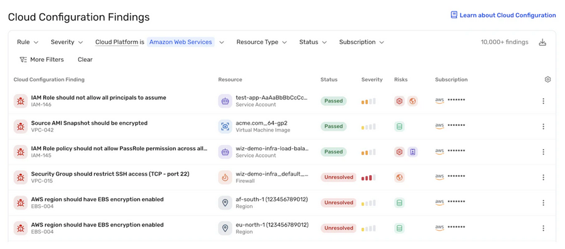
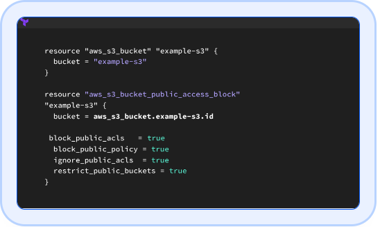
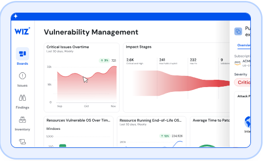
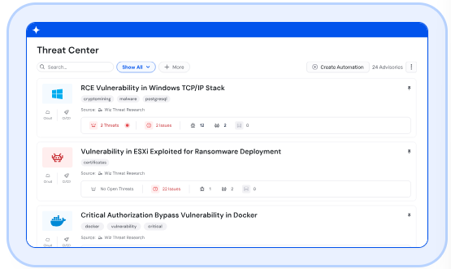
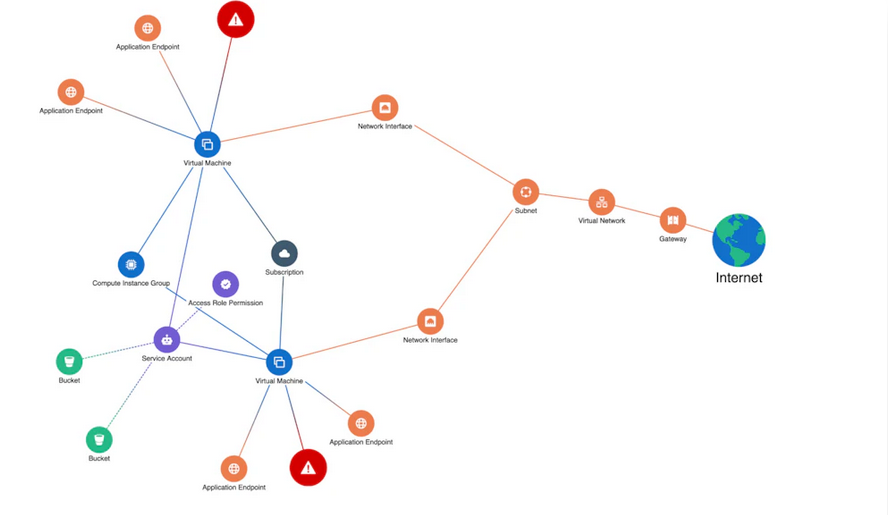
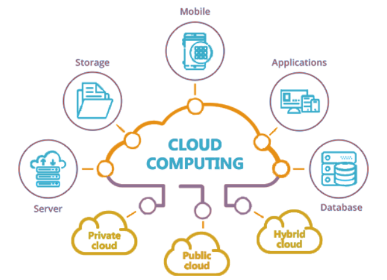
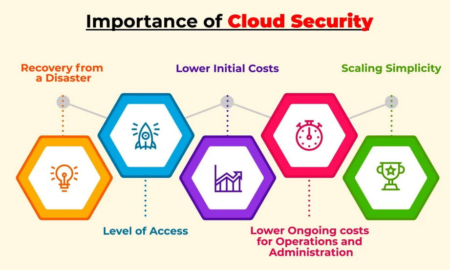

## Table of Contents
1. [Why Wiz](#why-wiz)
2. [A Partner in Your Cloud Journey](#a-partner-in-your-cloud-journey)
3. [Begin Development with Built-In Security](#begin-development-with-built-in-security)
    - [Key Features](#key-features)
    - [Benefits](#benefits)
4. [Proactively Identify and Mitigate Cloud Risks](#proactively-identify-and-mitigate-cloud-risks)
    - [Key Features](#key-features-1)
    - [Benefits](#benefits-1)
5. [Prevent Incidents from Escalating into Breaches](#prevent-incidents-from-escalating-into-breaches)
    - [Key Features](#key-features-2)
    - [Benefits](#benefits-2)
6. [Wiz: Eliminate Critical Risks in the Cloud](#wiz-eliminate-critical-risks-in-the-cloud)
7. [What is Cloud Security?](#what-is-cloud-security)
8. [Understanding Cloud Computing](#understanding-cloud-computing)
    - [Service Models](#service-models)
    - [Deployment Models](#deployment-models)
9. [How Cloud Security Works](#how-cloud-security-works)
10. [Why Cloud Security is Important](#why-cloud-security-is-important)
11. [Cloud Security Risks and Threats](#cloud-security-risks-and-threats)
    - [Intrinsic Risks](#intrinsic-risks)
    - [Extrinsic Risks](#extrinsic-risks)
12. [Types of Cloud Security Solutions](#types-of-cloud-security-solutions)
13. [Introducing CNAPP](#introducing-cnapp)
14. [Wiz for Government: Empowering Secure Cloud-Native Development](#wiz-for-government-empowering-secure-cloud-native-development)
15. [Securing the Software Supply Chain](#securing-the-software-supply-chain)
16. [Case Study: Enhancing Cloud Security for the U.S. Navy with Wiz](#case-study-enhancing-cloud-security-for-the-us-navy-with-wiz)
    - [Overview](#overview-simplifying-cloud-management)
    - [Challenges](#challenges)
    - [Solution](#solution)
    - [Results](#results)
    - [Looking Ahead](#looking-ahead-a-secure-agile-navy)

---
# Transforming Cloud Security: Seamless, Simple, and Secure

In today’s fast-paced digital world, cloud environments are essential for innovation—but they also come with complex security challenges. Wiz.io is here to simplify the process and empower organizations to achieve unparalleled protection without slowing down progress.

---

## Why Wiz

Wiz bridges the gap between development speed and security needs. Designed for multi-cloud environments, it enables teams to stay secure while focusing on delivering value.

- **Saving Time Without Compromise**: Developers can integrate security seamlessly into their workflows at every stage, ensuring nothing is overlooked.
- **Security Built Into Every Step**: By embedding security profiles from the start, Wiz ensures customer data remains protected and compliant throughout the project lifecycle.

---

## A Partner in Your Cloud Journey

Wiz isn't just a tool; it's a partner that grows with your organization. It combines innovation with robust security, empowering businesses to deliver impactful solutions securely, whether starting with the cloud or managing complex multi-cloud operations.

---

## Begin Development with Built-In Security

Building secure applications begins with embedding security into the development process. **Wiz Code** helps organizations proactively identify and address vulnerabilities from the earliest stages.

### Key Features

- **Infrastructure as Code Scanning**: Detect and fix misconfigurations before deployment.  
- **Secrets Scanning**: Protect sensitive credentials embedded in code.  
- **DSPM in Code**: Enforce data security for sensitive information like PHI and PII.  
- **Malware Scanning**: Eliminate malicious code early.  
- **Code & CI/CD Security Posture**: Strengthen the codebase and pipelines against threats.

### Benefits

- **Accelerated Issue Resolution**: Resolve cloud issues 10x faster by pinpointing fixes.  
- **Risk Prevention Before Production**: Stop critical issues from reaching production.  
- **Focused Prioritization**: Highlight and address the most critical risks efficiently.

[Learn More](https://www.wiz.io/platform/wiz-code)

---

## Proactively Identify and Mitigate Cloud Risks

Managing security across cloud environments can be complex. **Wiz Cloud** provides a unified platform for comprehensive visibility and risk prioritization, enabling teams to maintain a strong security posture.

### Key Features

- **Vulnerability Management**: Identify and prioritize vulnerabilities in your cloud environment, such as unpatched systems and misconfigurations, focusing on critical risks to reduce attack surfaces.  
- **Secure Cloud Identities (CIEM)**: Detect over-permissive roles and unused credentials to enforce least-privilege access and minimize identity-based threats.  
- **Container & Kubernetes Security**: Protect containerized workloads and Kubernetes environments by identifying vulnerabilities and ensuring secure configurations throughout deployment.  
- **Data Security (DSPM)**: Secure sensitive data by identifying improperly protected assets and ensuring compliance with privacy standards to prevent exposure.  
- **Secure AI (AI-SPM)**: Leverage AI-driven threat detection and automation to identify patterns and respond effectively to emerging risks.  
- **Compliance**: Streamline compliance by monitoring cloud environments against regulatory standards and providing actionable insights to close gaps.  
- **Cloud Workload Protection (CWP)**: Secure virtual machines, containers, and serverless functions by detecting and mitigating threats in real time.  
- **Infrastructure as Code Scanning**: Scan IaC templates to detect and fix misconfigurations before deployment, ensuring secure infrastructure from the start.  

### Benefits

- **Enhanced Visibility**: Gain 5x greater visibility with agentless scanning.  
- **Increased Efficiency**: Resolve risks faster with step-by-step guidance.  
- **Rapid ROI**: Immediate insights upon connecting to your cloud.

[Learn More](https://www.wiz.io/platform/wiz-code)

---

## Prevent Incidents from Escalating into Breaches

**Wiz Defend** monitors cloud environments in real-time, detecting and responding to threats swiftly. This enables organizations to prevent incidents from escalating into full-scale breaches.

### Key Features

- **eBPF-powered CWP**: Leverage eBPF technology to enhance cloud workload protection with real-time visibility and security enforcement at the kernel level.  
- **Kubernetes eBPF Runtime Protection**: Secure Kubernetes environments by detecting and mitigating runtime threats using eBPF for deep visibility into container behavior.  
- **Cloud Investigation and Response Automation (CIRA)**: Automate incident investigation and response workflows to quickly identify and address security issues across your cloud environment.  
- **Cloud Threat Intelligence and Hunting**: Proactively hunt for and mitigate threats using actionable intelligence tailored for cloud environments.  
- **Identity Detection and Response (ITDR)**: Strengthen identity security by detecting and responding to identity-based threats, such as credential misuse or privilege escalation.  
- **Data Detection and Response (DDR)**: Identify and respond to risks associated with sensitive data exposure and misuse, ensuring robust data protection across your cloud infrastructure.  

### Benefits

- **Accurate Threat Detection**: Minimize noise with behavioral analytics.  
- **Faster Response Times**: Resolve issues 10x faster.  
- **Enhanced Resilience**: Address root causes effectively.

[Learn More](https://www.wiz.io/platform/wiz-code)

---

## Wiz: Eliminate Critical Risks in the Cloud

Wiz helps organizations uncover and remediate high-severity risks in cloud environments without overwhelming teams with excessive alerts. The platform streamlines security with a proactive approach, ensuring businesses can innovate securely.

---

## What is Cloud Security?

Cloud security involves safeguarding cloud systems, data, and infrastructure through policies, controls, and technologies. It is a shared responsibility between cloud providers and customers to ensure robust protection.

---

## Understanding Cloud Computing

Cloud computing relies on service and deployment models:

### Service Models
- **SaaS (Software as a Service)**: Fully managed applications (e.g., Google Workspace, Salesforce).  
- **PaaS (Platform as a Service)**: Platforms for app development (e.g., Azure App Service, Heroku).  
- **IaaS (Infrastructure as a Service)**: Full control over virtual infrastructure (e.g., Amazon EC2, Google Compute Engine).

### Deployment Models
- **Public Cloud**: Shared, scalable resources for multiple users.  
- **Private Cloud**: Dedicated resources for a single organization.  
- **Hybrid Cloud**: Combines public and private cloud features for flexibility.

---

## How Cloud Security Works

Effective cloud security is achieved through key pillars:
- **Identity and Access Management (IAM)**: Ensures authorized access with multi-factor authentication.  
- **Infrastructure Protection**: Secures networks, endpoints, and virtual machines.  
- **Data Protection**: Encrypts data and prevents breaches using tokenization.  
- **Detection Controls**: Monitors suspicious activity with real-time alerts.  
- **Incident Response**: Enables swift recovery through predefined response plans.

---

## Why Cloud Security is Important

1. **Protection Against Evolving Threats**: Safeguards sensitive data with encryption and intrusion detection.  
2. **Business Continuity**: Ensures data backup and disaster recovery, minimizing downtime.  
3. **Compliance**: Meets regulatory standards like GDPR and HIPAA for secure operations.  
4. **Cost Efficiency**: Reduces on-premise hardware needs and optimizes processes.  
5. **Shared Responsibility**: Enhances combined efforts of providers and customers.

---

## Cloud Security Risks and Threats

### Intrinsic Risks
- Insecure APIs  
- Multi-tenancy vulnerabilities  
- Shared responsibility model confusion  

### Extrinsic Risks
- Misconfigurations  
- Phishing attacks  
- Insider threats  
- Supply chain attacks  

---

## Types of Cloud Security Solutions

1. **CSPM (Cloud Security Posture Management)**: Detects and remediates misconfigurations.  
2. **CWPP (Cloud Workload Protection Platform)**: Secures VMs, containers, and serverless workloads.  
3. **CIEM (Cloud Infrastructure Entitlement Management)**: Manages access permissions.  
4. **KSPM (Kubernetes Security Posture Management)**: Secures Kubernetes environments.  
5. **DSPM (Data Security Posture Management)**: Tracks and protects sensitive data.  
6. **CDR (Cloud Detection and Response)**: Responds to real-time cloud threats.

---

## Introducing CNAPP

Wiz’s **Cloud-Native Application Protection Platform (CNAPP)** offers a unified approach to cloud security, from development to runtime, ensuring compliance and risk mitigation.

### Key Benefits
- Comprehensive visibility into cloud environments.  
- Prioritized risk management with actionable insights.  
- Quick deployment for immediate value.

---

## Wiz for Government: Empowering Secure Cloud-Native Development

Wiz extends its FedRAMP-authorized services to include **Wiz Code**, providing visibility into attack paths from cloud to code. This secures the entire software development lifecycle.

---

## Securing the Software Supply Chain

**Wiz Code** ensures end-to-end security by:  
- Scanning code for vulnerabilities and misconfigurations.  
- Correlating risks from code to cloud with the **Wiz Security Graph**.  
- Streamlining collaboration between security and development teams.

---

## Breaking Down Silos in Development

Modern DevOps blurs lines between cloud infrastructure and applications, yet traditional security tools remain siloed. Wiz bridges these gaps by:
- Eliminating duplicated efforts.  
- Closing security visibility gaps.  
- Accelerating remediation by mapping risks back to code.

---

## Reducing Risk and Accelerating Deployment

**Wiz Code** integrates into developer workflows, offering:  
- Real-time security feedback in IDEs and pull requests.  
- Prioritized fixes for efficient risk management.  
- Unified risk assessment across the development lifecycle.

---

## Scaling Security Across Regulated Environments

Wiz Code aligns with regulatory standards like NIST and FedRAMP, ensuring continuous monitoring and compliance for industries with stringent requirements.

### Key Features of Wiz Code
1. **Unified Policy Engine**: Consistent security controls across environments.  
2. **Code-to-Cloud Mapping**: Traces risks back to source code repositories.  
3. **Accelerated Remediation**: Traces vulnerabilities for efficient fixes.  
4. **Real-Time Guardrails**: Provides security insights directly in development tools.  
5. **Regulatory Compliance**: Supports standards like OWASP and OpenSSF.

---

## Wiz Code in Action

By combining **Wiz Code**, **Wiz Cloud**, and **Wiz Defend**, organizations gain a unified platform for securing cloud-native applications and fostering collaboration between development and security teams.

---

## Case Study: Enhancing Cloud Security for the U.S. Navy with Wiz

### Overview: Simplifying Cloud Management

The U.S. Navy partnered with Wiz to simplify cloud security and improve operational efficiency. Wiz delivered unparalleled visibility, risk management, and automation.

### Challenges

- Complex cloud environments were difficult to secure.  
- Lack of visibility hindered risk management.  
- Existing tools were insufficient for dynamic workloads.

### Solution

- **Centralized Visibility**: Complete understanding of digital assets.  
- **Automated Security**: Streamlined compliance workflows.  
- **Enhanced Risk Management**: Proactive risk detection and mitigation.

### Results

- Reduced onboarding time from months to 30 minutes.  
- Improved collaboration across teams.  
- Achieved real-time compliance and scalability.

---

By leveraging Wiz, organizations like the U.S. Navy transform their cloud security strategy, ensuring scalability, agility, and compliance.

For more information, visit **[Wiz.io](https://www.wiz.io/customers/niwc-pac-sbs/)**.

---

### [Back to Top](#transforming-cloud-security-seamless-simple-and-secure)
